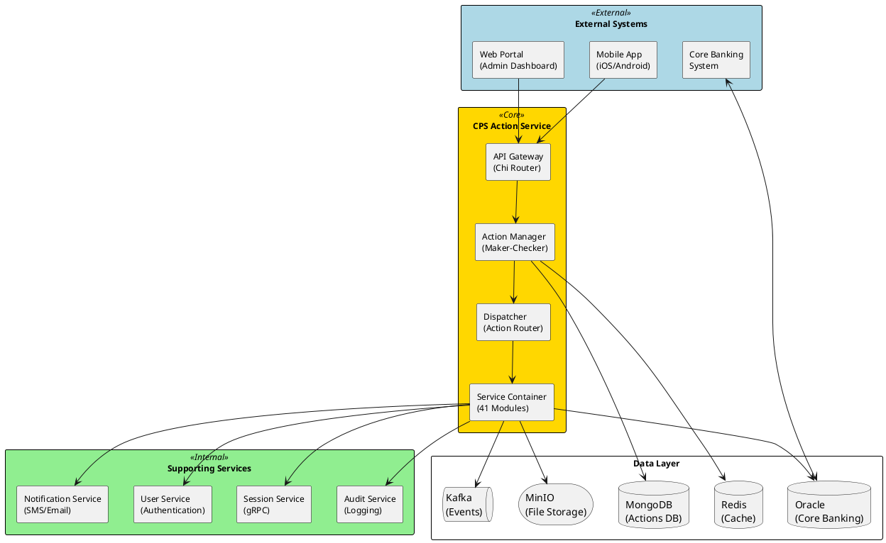
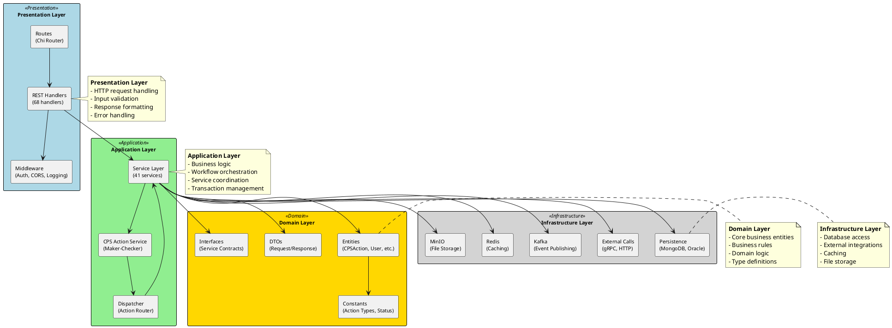
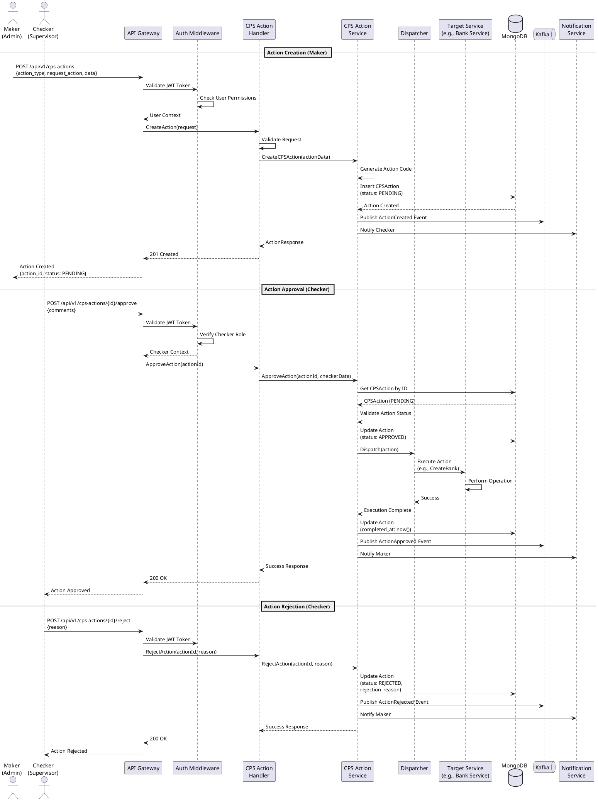
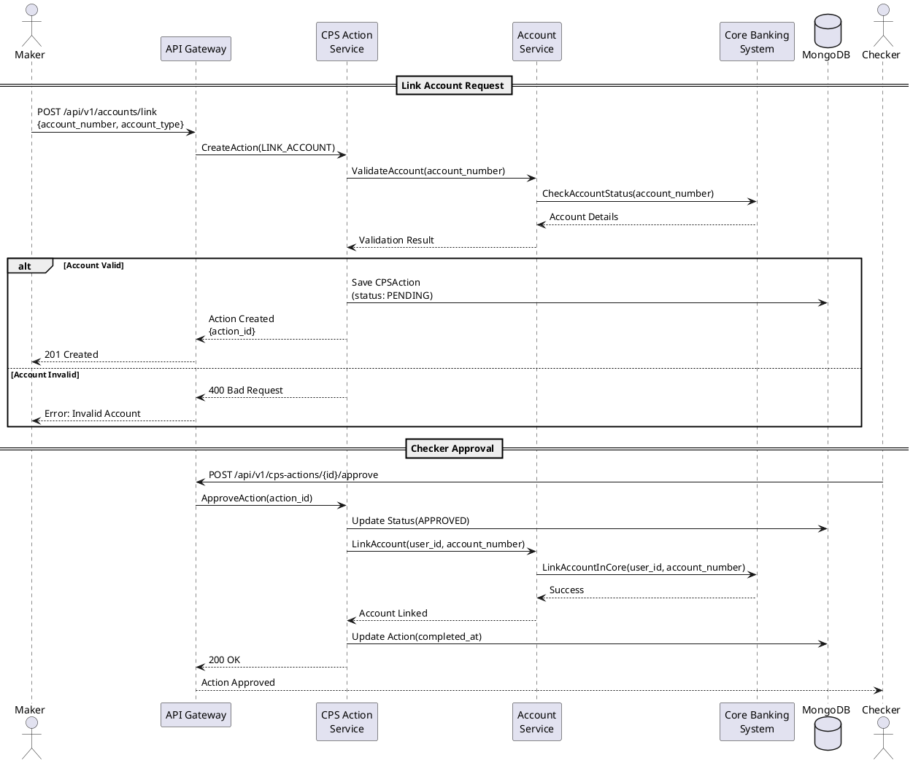
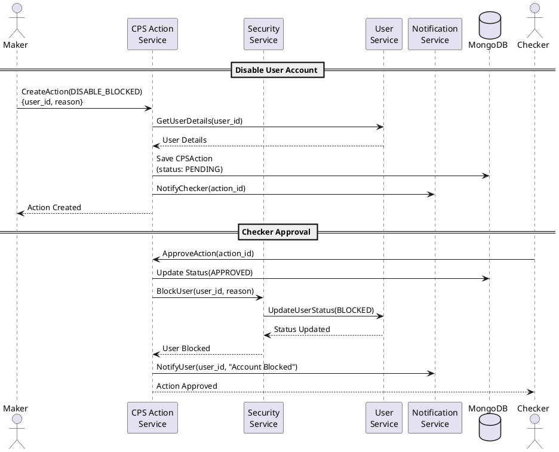
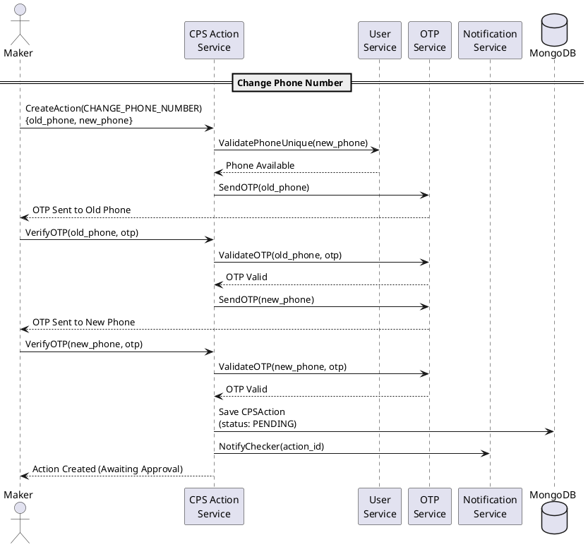
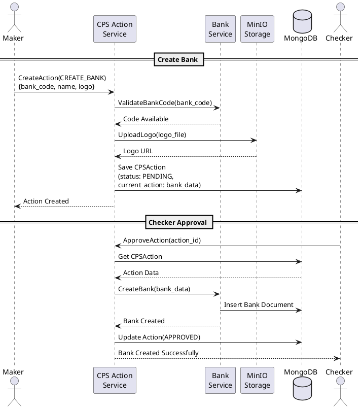
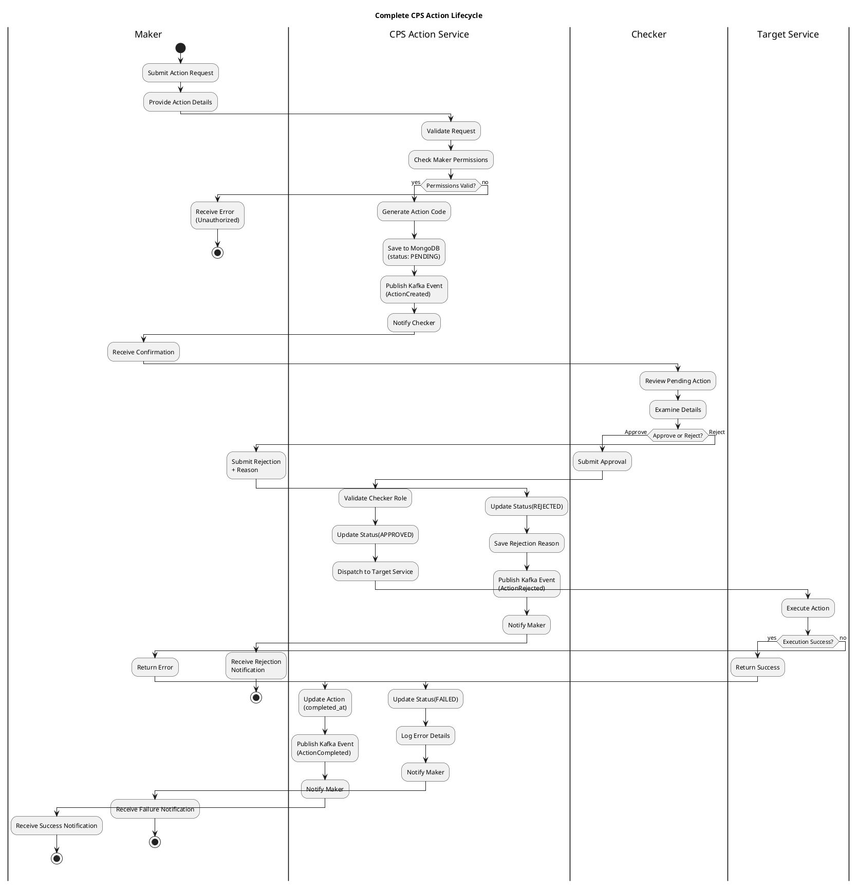

# Low-Level Design Document: CBE Super App - BPS Action Service

**Project:** Commercial Bank of Ethiopia (CBE) Super App  
**Module:** CPS (Customer and Partner Services) Action Module  
**Version:** 1.0  
**Date:** November 29, 2025  
**Author:** EagleLion System

---

## Table of Contents

1. [Executive Summary](#1-executive-summary)
2. [Service Overview](#2-service-overview)
3. [Architecture](#3-architecture)
4. [Data Models](#4-data-models)
5. [BPS Actions - Detailed Implementation](#5-bps-actions---detailed-implementation)

---

## 1. Executive Summary

### 1.1 Purpose

The **BPS (Banking Process Service) Action Module** is a critical microservice within the CBE Super App ecosystem that implements a **Maker-Checker** approval workflow for sensitive banking operations. This service ensures that all critical administrative actions undergo proper authorization before execution, providing:

- **Audit Trail**: Complete tracking of who initiated actions and who approved/rejected them
- **Security**: Multi-level verification for sensitive operations
- **Compliance**: Adherence to banking regulations requiring dual authorization
- **Accountability**: Clear separation of duties between makers and checkers

### 1.2 Key Capabilities

✅ **Maker-Checker Workflow**  
- Makers initiate actions (CREATE, UPDATE, DELETE, ENABLE, DISABLE)
- Checkers review and approve/reject pending actions
- Complete audit trail with timestamps and user details

✅ **Comprehensive Action Management**  
- 27+ action categories covering all administrative operations
- 200+ specific request actions
- Support for bulk operations

✅ **Real-time Status Tracking**  
- PENDING → APPROVED → REJECTED status flow
- Action expiration and timeout handling
- Rejection reason tracking

✅ **Multi-Service Integration**  
- 41 integrated service modules
- Event-driven architecture with Kafka
- gRPC communication for real-time operations

✅ **Security & Compliance**  
- Department-based access control
- User permission validation
- Complete action history preservation

### 1.3 Technology Stack

| Component | Technology | Version |
|-----------|-----------|---------|
| **Programming Language** | Go (Golang) | 1.25.0 |
| **Web Framework** | Chi Router | v5.2.3 |
| **Database** | MongoDB | v2.3.0 |
| **Cache** | Redis | v9.14.0 |
| **Message Queue** | Kafka (Sarama) | v1.46.1 |
| **RPC** | gRPC | v1.75.1 |
| **Object Storage** | MinIO | v7.0.92 |
| **Authentication** | JWT | v5.3.0 |
| **Logging** | Zap Logger | v1.27.0 |
| **API Documentation** | Swagger/OpenAPI | v1.16.6 |
| **Validation** | Ozzo Validation | v4.3.0 |
| **Oracle DB** | Godror | v0.49.5 |

---

## 2. Service Overview

### 2.1 Business Context

The CBE Super App serves millions of customers across Ethiopia, providing comprehensive banking services through mobile and web platforms. The CPS Action Module addresses critical business requirements:

**Business Challenges:**
1. **Regulatory Compliance**: Ethiopian banking regulations require dual authorization for sensitive operations
2. **Fraud Prevention**: Separation of duties prevents unauthorized changes
3. **Audit Requirements**: Complete traceability of all administrative actions
4. **Operational Efficiency**: Streamlined approval workflows reduce processing time

**Business Value:**
- **Risk Mitigation**: Reduces fraud and errors through maker-checker controls
- **Regulatory Compliance**: Meets central bank requirements for dual authorization
- **Operational Transparency**: Complete visibility into all administrative actions
- **Accountability**: Clear responsibility assignment for all changes

**Key Stakeholders:**
- **Bank Administrators**: Create and manage system configurations
- **Supervisors/Checkers**: Review and approve pending actions
- **Compliance Officers**: Monitor and audit all actions
- **System Auditors**: Review action history for compliance

### 2.2 Service Boundaries



**Service Responsibilities:**

| Responsibility | Description |
|---------------|-------------|
| **Action Initiation** | Receive and validate action requests from makers |
| **Workflow Management** | Route actions through approval workflows |
| **Status Tracking** | Monitor action lifecycle (PENDING → APPROVED/REJECTED) |
| **Approval Processing** | Handle checker approvals and rejections |
| **Action Execution** | Dispatch approved actions to respective services |
| **Audit Logging** | Record all action events for compliance |
| **Notification** | Alert users about action status changes |

**Out of Scope:**
- ❌ User authentication (handled by User Service)
- ❌ Direct database modifications (uses service layer)
- ❌ Transaction processing (delegated to Transaction Service)
- ❌ Account management (delegated to Account Service)

### 2.3 Supported Action Types

The service supports **27 major categories** with **200+ specific actions**:

#### Action Categories Summary

| Category | Actions | Count | Description |
|----------|---------|-------|-------------|
| **Account Management** | LINK_ACCOUNT, UNLINK_ACCOUNT, ADD_ACCOUNT, LINK_ANDOR_ACCOUNT | 4 | Manage user account linkages |
| **Security Operations** | UNLINK_DEVICE, ENABLE_BLOCKED, DISABLE_BLOCKED | 3 | Device and security management |
| **Profile Management** | CHANGE_PHONE_NUMBER, CHANGE_EMAIL, ATTACH_PHONE_NUMBER, DETACH_PHONE_NUMBER | 4 | User profile updates |
| **User Status** | ENABLE_USER, DISABLE_USER, ENABLE_DISABLE_USER, ACTIVATE_ACCOUNT, REACTIVATE | 5 | User account status control |
| **Transaction Limits** | UPDATE_TRANSFER_LIMIT, CREATE_TRANSFER_LIMIT, RESET_TRANSFER_LIMIT, UPDATE_ONE_LIMIT, UPDATE_LIMIT, LIMIT_TRANSFER | 6 | Transaction limit management |
| **Access Control** | ACCESS_CONTROL, RESET_ACCESS_CONTROL | 2 | Permission and access management |
| **KYC** | UPGRADE_KYC_LEVEL | 1 | Know Your Customer upgrades |
| **Cheque** | CREATE_CHEQUE_AUTHORIZATION_ACTION | 1 | Cheque authorization |
| **Bank Management** | CREATE_BANK, UPDATE_BANK, DELETE_BANK, ENABLE_BANK, DISABLE_BANK, UPDATE_BANK_LOGO | 6 | Bank configuration |
| **Department** | CREATE_DEPARTMENT, UPDATE_DEPARTMENT, ENABLE_DISABLE_DEPARTMENT | 3 | Department management |
| **Permission Groups** | CREATE_PERMISSION_GROUP, UPDATE_PERMISSION_GROUP, DELETE_PERMISSION_GROUP | 3 | Permission management |
| **CPS Users** | CREATE_CPS_USER, UPDATE_CPS_USER, DELETE_CPS_USER, ENABLE_CPS_USER, DISABLE_CPS_USER | 5 | CPS user management |
| **BPS Users** | ENABLE_BPS_USER, DISABLE_BPS_USER | 2 | BPS user management |
| **Wallets** | CREATE_WALLET, UPDATE_WALLET, DELETE_WALLET, ENABLE_WALLET, DISABLE_WALLET | 5 | Wallet management |
| **Advertisements** | CREATE_ADVERT, UPDATE_ADVERT, ENABLE_ADVERT, DISABLE_ADVERT, DELETE_ADVERT | 5 | Advertisement management |
| **Events** | CREATE_EVENT, UPDATE_EVENT, DELETE_EVENT, ENABLE_EVENT, DISABLE_EVENT, CREATE_EVENT_CATEGORY, UPDATE_EVENT_CATEGORY | 7 | Event management |
| **Mini Apps** | CREATE_MINI_APP, UPDATE_MINI_APP, DELETE_MINI_APP, ENABLE_MINI_APP, DISABLE_MINI_APP | 5 | Mini app management |
| **Mini App Merchants** | CREATE_MINI_APP_MERCHANT, UPDATE_MINI_APP_MERCHANT, DELETE_MINI_APP_MERCHANT, ENABLE_MINI_APP_MERCHANT, DISABLE_MINI_APP_MERCHANT | 5 | Merchant management |
| **Donations** | CREATE_DONATION, UPDATE_DONATION, ENABLE_DONATION, DISABLE_DONATION, ADD_DONATION_IMAGE, UPDATE_DONATION_IMAGE, DELETE_DONATION_IMAGE | 7 | Donation management |
| **Donation Categories** | CREATE_DONATION_CATEGORY, UPDATE_DONATION_CATEGORY, ENABLE_DONATION_CATEGORY, DISABLE_DONATION_CATEGORY | 4 | Donation category management |
| **Donation Companies** | CREATE_DONATION_COMPANY, UPDATE_DONATION_COMPANY, ENABLE_DONATION_COMPANY, DISABLE_DONATION_COMPANY | 4 | Donation company management |
| **Budget Categories** | CREATE_BUDGET_CATEGORY, UPDATE_BUDGET_CATEGORY, DELETE_BUDGET_CATEGORY | 3 | Budget management |
| **Avatars** | CREATE_AVATAR, UPDATE_AVATAR, DELETE_AVATAR, ENABLE_AVATAR, DISABLE_AVATAR | 5 | Avatar management |
| **Notifications** | CREATE_PUBLIC_NOTIFICATION, UPDATE_PUBLIC_NOTIFICATION, DELETE_NOTIFICATION, ENABLE_NOTIFICATION, DISABLE_NOTIFICATION | 5 | Notification management |
| **Articles** | CREATE_ARTICLE, UPDATE_ARTICLE, DELETE_ARTICLE, ENABLE_ARTICLE, DISABLE_ARTICLE | 5 | Article/news management |
| **Bank Vault** | CREATE_VAULT_BANK, UPDATE_VAULT_BANK, DELETE_VAULT_BANK, ENABLE_VAULT_BANK, DISABLE_VAULT_BANK | 5 | Bank vault products |
| **Device Version** | CREATE_DEVICE_VERSION, UPDATE_DEVICE_VERSION, DELETE_DEVICE_VERSION, ENABLE_DEVICE_VERSION, DISABLE_DEVICE_VERSION | 5 | App version control |

**Total Actions**: 200+ specific request actions across 27 categories

---

## 3. Architecture

### 3.1 Clean Architecture Layers

The service follows **Clean Architecture** principles with clear separation of concerns:



**Layer Responsibilities:**

| Layer | Directory | Responsibility | Dependencies |
|-------|-----------|---------------|--------------|
| **Presentation** | `internal/handlers`, `internal/glue` | HTTP request handling, routing, middleware | Application Layer |
| **Application** | `internal/service` | Business logic, workflow orchestration | Domain Layer, Infrastructure |
| **Domain** | `internal/constants` | Core entities, business rules, types | None (pure domain) |
| **Infrastructure** | `internal/storage` | Data persistence, external services | Domain Layer |

### 3.2 Component Interaction Flow



**Flow Description:**

1. **Action Creation (Maker)**:
   - Maker submits action request via API
   - System validates permissions and request data
   - Action stored in MongoDB with PENDING status
   - Checker notified via Kafka event

2. **Action Approval (Checker)**:
   - Checker reviews pending action
   - System validates checker permissions
   - Action status updated to APPROVED
   - Dispatcher routes action to target service
   - Target service executes the operation
   - Maker notified of approval

3. **Action Rejection (Checker)**:
   - Checker rejects action with reason
   - Action status updated to REJECTED
   - Maker notified with rejection reason

### 3.3 Directory Structure

```
cbe-supper-app-cps-action/
├── cmd/                              # Application entry point
│   └── main.go                       # Main application file
├── config/                           # Configuration management
│   ├── config.go                     # Config loader
│   ├── dev.yaml                      # Development config
│   └── prod.yaml                     # Production config
├── docs/                             # Documentation
│   ├── swagger/                      # OpenAPI specifications
│   └── BPS-ACTION-SERVICE-LLD.md     # This document
├── grpc/                             # gRPC definitions
│   ├── session/                      # Session service proto
│   └── sitota/                       # Transaction service proto
├── initiator/                        # Dependency injection
│   ├── service.go                    # Service initialization
│   ├── persistence.go                # Persistence initialization
│   └── grpc.go                       # gRPC client initialization
├── internal/                         # Core application code
│   ├── constants/                    # Domain constants
│   │   ├── constants.go              # Global constants
│   │   ├── dto/                      # Data Transfer Objects (100+ DTOs)
│   │   ├── model/                    # Domain models (49 models)
│   │   │   ├── cps_action.go         # CPSAction entity
│   │   │   └── ...                   # Other entities
│   │   ├── interfaces/               # Service interfaces
│   │   ├── lib/                      # Shared libraries
│   │   └── localization/             # i18n messages
│   ├── glue/                         # API layer
│   │   └── routes.go                 # Route definitions
│   ├── handlers/                     # HTTP handlers (72 handlers)
│   │   └── rest/                     # REST API handlers
│   │       ├── account_block/        # Account blocking handlers
│   │       ├── ad/                   # Advertisement handlers
│   │       ├── bank/                 # Bank handlers
│   │       ├── cps_action/           # CPS Action handlers
│   │       ├── cps_user/             # CPS User handlers
│   │       └── ...                   # 35+ handler modules
│   ├── service/                      # Business logic layer (80 services)
│   │   ├── service.go                # Service container
│   │   ├── cps_action/               # CPS Action service
│   │   │   ├── action_service.go     # Core action service
│   │   │   ├── dispatcher.go         # Action dispatcher
│   │   │   └── constants.go          # Action constants
│   │   ├── account_block/            # Account blocking service
│   │   ├── account_validation/       # Validation service
│   │   ├── ad/                       # Advertisement service
│   │   ├── amount_based_auth/        # Auth service
│   │   ├── avatar/                   # Avatar service
│   │   ├── bank/                     # Bank service
│   │   ├── bankvault/                # Bank vault service
│   │   ├── bps_user/                 # BPS user service
│   │   ├── budget_category/          # Budget service
│   │   ├── bulk/                     # Bulk operations service
│   │   ├── cps_user/                 # CPS user service
│   │   ├── customer/                 # Customer service
│   │   ├── department/               # Department service
│   │   ├── device_version/           # Device version service
│   │   ├── donation/                 # Donation service
│   │   ├── donation_category/        # Donation category service
│   │   ├── donation_company/         # Donation company service
│   │   ├── encryption/               # Encryption service
│   │   ├── event/                    # Event service
│   │   ├── fayda/                    # Fayda integration service
│   │   ├── feedback/                 # Feedback service
│   │   ├── hq/                       # HQ service
│   │   ├── kyc_verifier/             # KYC verification service
│   │   ├── media/                    # Media/article service
│   │   ├── mini_app/                 # Mini app service
│   │   ├── mini_app_merchant/        # Merchant service
│   │   ├── news_category/            # News category service
│   │   ├── news_tag/                 # News tag service
│   │   ├── notification/             # Notification service
│   │   ├── password_rule/            # Password rule service
│   │   ├── permission/               # Permission service
│   │   ├── portal_card/              # Portal card service
│   │   ├── productcode/              # Product code service
│   │   ├── service_details/          # Service details service
│   │   ├── sitota/                   # Sitota transaction service
│   │   ├── topup/                    # Topup service
│   │   ├── unlink/                   # Unlink service
│   │   ├── vaultgroup_category/      # Vault group service
│   │   └── wallet/                   # Wallet service
│   └── storage/                      # Data access layer (129 files)
│       ├── repository.go             # Repository interface
│       ├── redis_repository.go       # Redis repository
│       ├── persistance/              # MongoDB persistence (109 files)
│       ├── external_call/            # External API calls
│       ├── kafka/                    # Kafka producers
│       └── api/                      # API clients
├── pkgs/                             # Shared packages
│   ├── keygen/                       # Key generation utilities
│   └── ...                           # Other utilities
├── platform/                         # Platform-specific code
├── proto/                            # Protocol buffer definitions
├── scripts/                          # Build and deployment scripts
├── go.mod                            # Go module definition
├── go.sum                            # Go dependencies checksum
├── Jenkinsfile                       # CI/CD pipeline
└── README.md                         # Project documentation
```

**Key Directories:**

- **`cmd/`**: Application entry point and initialization
- **`internal/constants/`**: Domain models, DTOs, and constants (292 files)
- **`internal/handlers/`**: HTTP request handlers (72 handlers)
- **`internal/service/`**: Business logic layer (41 services, 80 files)
- **`internal/storage/`**: Data persistence and external integrations (129 files)
- **`initiator/`**: Dependency injection and service wiring
- **`grpc/`**: gRPC service definitions and clients

---

## 4. Data Models

### 4.1 Core Entity: CPSAction

The `CPSAction` entity is the central data model representing all administrative actions in the system.

```go
type CPSAction struct {
    ID                 bson.ObjectID `bson:"_id,omitempty" json:"id,omitempty"`
    ActionCode         string        `bson:"action_code" json:"action_code"`
    UniqueId           string        `bson:"unique_id" json:"unique_id,omitempty"`
    MakerID            string        `bson:"maker_id" json:"maker_id"`
    MakerName          string        `bson:"maker_name" json:"maker_name"`
    MakerPhoneNumber   string        `bson:"maker_phone_number" json:"maker_phone_number"`
    CheckerID          string        `bson:"checker_id" json:"checker_id,omitempty"`
    CheckerName        string        `bson:"checker_name" json:"checker_name,omitempty"`
    CheckerPhoneNumber string        `bson:"checker_phone_number" json:"checker_phone_number,omitempty"`
    Department         string        `bson:"department" json:"department"`
    RejectionReason    string        `bson:"rejection_reason" json:"rejection_reason,omitempty"`
    PreviousAction     interface{}   `bson:"previous_action" json:"previous_action,omitempty"`
    CurrentAction      interface{}   `bson:"current_action" json:"current_action,omitempty"`
    ActionStatus       string        `bson:"action_status" json:"action_status,omitempty"`
    ActionType         string        `bson:"action_type" json:"action_type,omitempty"`
    IsDeleted          bool          `bson:"is_deleted" json:"is_deleted,omitempty"`
    RequestAction      string        `bson:"request_action" json:"request_action"`
    CreatedAt          time.Time     `bson:"created_at" json:"created_at,omitempty"`
    LastModifiedAt     time.Time     `bson:"last_modified_at" json:"last_modified_at,omitempty"`
    MakerActionTime    time.Time     `bson:"maker_action_time" json:"maker_action_time,omitempty"`
    CheckerActionTime  *time.Time    `bson:"checker_action_time" json:"checker_action_time,omitempty"`
}
```

#### Field Descriptions

| Field | Type | Required | Description |
|-------|------|----------|-------------|
| **ID** | ObjectID | Yes | MongoDB unique identifier |
| **ActionCode** | string | Yes | Unique action code (auto-generated) |
| **UniqueId** | string | No | Additional unique identifier |
| **MakerID** | string | Yes | User ID of the action initiator |
| **MakerName** | string | Yes | Full name of the maker |
| **MakerPhoneNumber** | string | Yes | Contact number of the maker |
| **CheckerID** | string | No | User ID of the approver/rejector |
| **CheckerName** | string | No | Full name of the checker |
| **CheckerPhoneNumber** | string | No | Contact number of the checker |
| **Department** | string | Yes | Department of the maker |
| **RejectionReason** | string | No | Reason for rejection (if rejected) |
| **PreviousAction** | interface{} | No | Original data before modification (for UPDATE actions) |
| **CurrentAction** | interface{} | Yes | New data to be applied |
| **ActionStatus** | string | Yes | Current status: PENDING, APPROVED, REJECTED |
| **ActionType** | string | Yes | Type: CREATE, UPDATE, DELETE, ENABLE, DISABLE |
| **IsDeleted** | bool | No | Soft delete flag |
| **RequestAction** | string | Yes | Specific action identifier (e.g., CREATE_BANK) |
| **CreatedAt** | time.Time | Yes | Action creation timestamp |
| **LastModifiedAt** | time.Time | Yes | Last modification timestamp |
| **MakerActionTime** | time.Time | Yes | When maker initiated the action |
| **CheckerActionTime** | *time.Time | No | When checker approved/rejected |

#### Action Status Enum

```go
type ActionStatus string

const (
    ActionPending  ActionStatus = "PENDING"   // Awaiting checker approval
    ActionApproved ActionStatus = "APPROVED"  // Approved by checker
    ActionRejected ActionStatus = "REJECTED"  // Rejected by checker
)
```

#### Action Type Enum

```go
type ActionType string

const (
    ActionCreate  ActionType = "CREATE"   // Create new entity
    ActionUpdate  ActionType = "UPDATE"   // Modify existing entity
    ActionDelete  ActionType = "DELETE"   // Remove entity
    ActionEnable  ActionType = "ENABLE"   // Enable/activate entity
    ActionDisable ActionType = "DISABLE"  // Disable/deactivate entity
)
```

### 4.2 Supporting Entities

#### CheckCPSAction

Used for validating checker permissions:

```go
type CheckCPSAction struct {
    UserCode      string  // Checker's user code
    FullName      string  // Checker's full name
    PhoneNumber   string  // Checker's phone number
    Department    string  // Checker's department
    RequestAction string  // Action being checked
}
```

**Field Descriptions:**

| Field | Description |
|-------|-------------|
| **UserCode** | Unique identifier for the checker user |
| **FullName** | Checker's complete name for audit trail |
| **PhoneNumber** | Contact information for notifications |
| **Department** | Department affiliation for permission validation |
| **RequestAction** | Specific action type being validated |

---

## 5. BPS Actions - Detailed Implementation

This section provides detailed implementation guides for each major action category, including purpose, business rules, and sequence diagrams.

### 5.1 Account Management Actions

#### Purpose
Manage user account linkages and associations within the CBE Super App ecosystem.

#### Supported Actions
1. **LINK_ACCOUNT**: Link a new bank account to user profile
2. **UNLINK_ACCOUNT**: Remove linked bank account
3. **ADD_ACCOUNT**: Add additional account
4. **LINK_ANDOR_ACCOUNT**: Link account with AND/OR logic

#### Business Rules

| Rule | Description |
|------|-------------|
| **BR-AM-001** | User can link maximum 5 accounts per profile |
| **BR-AM-002** | Account unlinking requires checker approval |
| **BR-AM-003** | Primary account cannot be unlinked without designating new primary |
| **BR-AM-004** | Linked accounts must belong to the same customer |
| **BR-AM-005** | Account must be active in core banking system |

#### Architecture Flow



### 5.2 Security Operations

#### Purpose
Manage device security and user blocking/unblocking operations.

#### Supported Actions
1. **UNLINK_DEVICE**: Remove device from user account
2. **ENABLE_BLOCKED**: Unblock user account
3. **DISABLE_BLOCKED**: Block user account

#### Business Rules

| Rule | Description |
|------|-------------|
| **BR-SO-001** | Device unlinking requires OTP verification |
| **BR-SO-002** | Account blocking requires checker approval |
| **BR-SO-003** | Blocked accounts cannot perform transactions |
| **BR-SO-004** | Maximum 3 devices can be linked per user |
| **BR-SO-005** | Unblocking requires reason documentation |

#### Architecture Flow



### 5.3 Profile Management

#### Purpose
Handle user profile updates including phone number and email changes.

#### Supported Actions
1. **CHANGE_PHONE_NUMBER**: Update primary phone number
2. **CHANGE_EMAIL**: Update email address
3. **ATTACH_PHONE_NUMBER**: Add secondary phone number
4. **DETACH_PHONE_NUMBER**: Remove secondary phone number

#### Business Rules

| Rule | Description |
|------|-------------|
| **BR-PM-001** | Phone number change requires OTP verification on both old and new numbers |
| **BR-PM-002** | Email change requires email verification link |
| **BR-PM-003** | Phone number must be unique across all users |
| **BR-PM-004** | Email must be unique across all users |
| **BR-PM-005** | Primary phone number cannot be detached without replacement |

#### Architecture Flow



### 5.4 User Status Management

#### Purpose
Control user account activation, deactivation, and reactivation.

#### Supported Actions
1. **ENABLE_USER**: Activate user account
2. **DISABLE_USER**: Deactivate user account
3. **ENABLE_DISABLE_USER**: Toggle user status
4. **ACTIVATE_ACCOUNT**: Initial account activation
5. **REACTIVATE**: Reactivate dormant account

#### Business Rules

| Rule | Description |
|------|-------------|
| **BR-US-001** | Account activation requires KYC completion |
| **BR-US-002** | Deactivation requires checker approval |
| **BR-US-003** | Dormant accounts (>90 days inactive) require reactivation |
| **BR-US-004** | Deactivated accounts cannot perform any operations |
| **BR-US-005** | Reactivation requires identity verification |

### 5.5 Transaction Limits

#### Purpose
Manage transaction limits for users and services.

#### Supported Actions
1. **UPDATE_TRANSFER_LIMIT**: Modify transfer limits
2. **CREATE_TRANSFER_LIMIT**: Set new transfer limits
3. **RESET_TRANSFER_LIMIT**: Reset to default limits
4. **UPDATE_ONE_LIMIT**: Update single limit
5. **UPDATE_LIMIT**: Update multiple limits
6. **LIMIT_TRANSFER**: Apply transfer restrictions

#### Business Rules

| Rule | Description |
|------|-------------|
| **BR-TL-001** | Limit increases require checker approval |
| **BR-TL-002** | Limits must not exceed regulatory maximums |
| **BR-TL-003** | Daily limits reset at midnight |
| **BR-TL-004** | KYC level determines maximum allowed limits |
| **BR-TL-005** | Limit decreases take effect immediately |

### 5.6 Bank Management

#### Purpose
Manage bank configurations and integrations.

#### Supported Actions
1. **CREATE_BANK**: Add new bank to system
2. **UPDATE_BANK**: Modify bank details
3. **DELETE_BANK**: Remove bank
4. **ENABLE_BANK**: Activate bank
5. **DISABLE_BANK**: Deactivate bank
6. **UPDATE_BANK_LOGO**: Change bank logo

#### Business Rules

| Rule | Description |
|------|-------------|
| **BR-BM-001** | Bank creation requires checker approval |
| **BR-BM-002** | Bank code must be unique |
| **BR-BM-003** | Disabled banks cannot process transactions |
| **BR-BM-004** | Bank deletion requires zero active accounts |
| **BR-BM-005** | Logo must be in PNG/JPG format, max 2MB |

#### Architecture Flow



### 5.7 Department Management

#### Purpose
Manage organizational departments and their configurations.

#### Supported Actions
1. **CREATE_DEPARTMENT**: Create new department
2. **UPDATE_DEPARTMENT**: Modify department details
3. **ENABLE_DISABLE_DEPARTMENT**: Toggle department status

#### Business Rules

| Rule | Description |
|------|-------------|
| **BR-DM-001** | Department code must be unique |
| **BR-DM-002** | Department deletion requires zero active users |
| **BR-DM-003** | Disabled departments cannot create new actions |
| **BR-DM-004** | Department hierarchy must be acyclic |
| **BR-DM-005** | Root department cannot be disabled |

### 5.8 Permission Management

#### Purpose
Manage user permissions and permission groups.

#### Supported Actions
1. **CREATE_PERMISSION_GROUP**: Create permission group
2. **UPDATE_PERMISSION_GROUP**: Modify permissions
3. **DELETE_PERMISSION_GROUP**: Remove permission group

#### Business Rules

| Rule | Description |
|------|-------------|
| **BR-PRM-001** | Permission changes require checker approval |
| **BR-PRM-002** | Super admin permissions cannot be modified |
| **BR-PRM-003** | Permission group deletion requires zero assigned users |
| **BR-PRM-004** | Permissions are hierarchical (inherit from parent) |
| **BR-PRM-005** | Audit trail required for all permission changes |

### 5.9 Wallet Management

#### Purpose
Manage digital wallet configurations.

#### Supported Actions
1. **CREATE_WALLET**: Create new wallet type
2. **UPDATE_WALLET**: Modify wallet configuration
3. **DELETE_WALLET**: Remove wallet type
4. **ENABLE_WALLET**: Activate wallet
5. **DISABLE_WALLET**: Deactivate wallet

#### Business Rules

| Rule | Description |
|------|-------------|
| **BR-WM-001** | Wallet creation requires checker approval |
| **BR-WM-002** | Wallet code must be unique |
| **BR-WM-003** | Disabled wallets cannot accept transactions |
| **BR-WM-004** | Wallet deletion requires zero balance |
| **BR-WM-005** | Wallet limits must comply with regulations |

### 5.10 Complete Action Flow Diagram



---

## Appendix A: API Endpoints Reference

### Base URL
```
https://api.cbe-superapp.com/api/v1
```

### Authentication
All endpoints require JWT Bearer token:
```
Authorization: Bearer <jwt_token>
```

### Core Endpoints

| Method | Endpoint | Description | Required Role |
|--------|----------|-------------|---------------|
| POST | `/cps-actions` | Create new action | Maker |
| GET | `/cps-actions` | List all actions | Maker/Checker |
| GET | `/cps-actions/{id}` | Get action details | Maker/Checker |
| POST | `/cps-actions/{id}/approve` | Approve action | Checker |
| POST | `/cps-actions/{id}/reject` | Reject action | Checker |
| DELETE | `/cps-actions/{id}` | Cancel pending action | Maker |
| GET | `/cps-actions/pending` | List pending actions | Checker |
| GET | `/cps-actions/history` | Get action history | Maker/Checker |

---

## Appendix B: Error Codes

| Code | Message | Description |
|------|---------|-------------|
| `CPS-001` | Invalid action type | Unsupported action type |
| `CPS-002` | Unauthorized maker | User lacks maker permissions |
| `CPS-003` | Unauthorized checker | User lacks checker permissions |
| `CPS-004` | Action not found | Invalid action ID |
| `CPS-005` | Invalid action status | Cannot perform operation on current status |
| `CPS-006` | Duplicate action | Action already exists |
| `CPS-007` | Validation failed | Request data validation error |
| `CPS-008` | Execution failed | Target service execution error |
| `CPS-009` | Action expired | Action exceeded timeout period |
| `CPS-010` | Self-approval denied | Maker cannot approve own action |

---

## Appendix C: Deployment Configuration

### Environment Variables

```bash
# Application
APP_ENV=production
APP_PORT=8080
SERVER_TIMEOUT=30s

# MongoDB
MONGO_URI=mongodb://localhost:27017
MONGO_DATABASE=cbe_cps_action
MONGO_MAX_POOL_SIZE=100

# Redis
REDIS_HOST=localhost
REDIS_PORT=6379
REDIS_PASSWORD=<password>
REDIS_DB=0

# Kafka
KAFKA_BROKERS=localhost:9092
KAFKA_TOPIC_ACTION_CREATED=cps.action.created
KAFKA_TOPIC_ACTION_APPROVED=cps.action.approved
KAFKA_TOPIC_ACTION_REJECTED=cps.action.rejected

# MinIO
MINIO_ENDPOINT=localhost:9000
MINIO_ACCESS_KEY=<access_key>
MINIO_SECRET_KEY=<secret_key>
MINIO_USE_SSL=false

# gRPC
GRPC_SESSION_SERVICE=localhost:50051
GRPC_TRANSACTION_SERVICE=localhost:50052

# JWT
JWT_SECRET=<secret_key>
JWT_EXPIRATION=24h

# Oracle (Core Banking)
ORACLE_DSN=<connection_string>
ORACLE_MAX_OPEN_CONNS=50
```

---

## Document Version History

| Version | Date | Author | Changes |
|---------|------|--------|---------|
| 1.0 | 2025-11-29 | EagleLion System | Initial comprehensive LLD document |

---

**End of Document**
