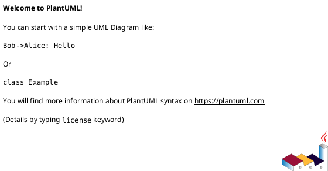

# LLD for BPS — Extracted with Images, OCR, and PlantUML Placeholders
> Source: docs/lld for bps.pdf


---

## Item 1 — lld for bps_01_Image1.jpg


_No OCR text extracted._

### PlantUML Placeholder



---

## Item 2 — lld for bps_01_Image10.jpg


_No OCR text extracted._

### PlantUML Placeholder


---

## Item 3 — lld for bps_01_Image11.jpg


_No OCR text extracted._

### PlantUML Placeholder


---

## Item 4 — lld for bps_01_Image12.jpg


_No OCR text extracted._

### PlantUML Placeholder


---

## Item 5 — lld for bps_01_Image13.jpg


_No OCR text extracted._

### PlantUML Placeholder


---

## Item 6 — lld for bps_01_Image14.jpg


_No OCR text extracted._

### PlantUML Placeholder


---

## Item 7 — lld for bps_01_Image15.jpg


_No OCR text extracted._

### PlantUML Placeholder


---

## Item 8 — lld for bps_01_Image16.jpg


_No OCR text extracted._

### PlantUML Placeholder


---

## Item 9 — lld for bps_01_Image17.jpg


_No OCR text extracted._

### PlantUML Placeholder


---

## Item 10 — lld for bps_01_Image2.jpg


_No OCR text extracted._

### PlantUML Placeholder


---

## Item 11 — lld for bps_01_Image3.jpg


_No OCR text extracted._

### PlantUML Placeholder


---

## Item 12 — lld for bps_01_Image4.jpg


_No OCR text extracted._

### PlantUML Placeholder


---

## Item 13 — lld for bps_01_Image5.jpg


_No OCR text extracted._

### PlantUML Placeholder


---

## Item 14 — lld for bps_01_Image6.jpg


_No OCR text extracted._

### PlantUML Placeholder


---

## Item 15 — lld for bps_01_Image7.jpg


_No OCR text extracted._

### PlantUML Placeholder


---

## Item 16 — lld for bps_01_Image8.jpg


_No OCR text extracted._

### PlantUML Placeholder


---

## Item 17 — lld for bps_01_Image9.jpg


_No OCR text extracted._

### PlantUML Placeholder


---

## Item 18 — lld for bps_02_Image1.jpg


_No OCR text extracted._

### PlantUML Placeholder


---

## Item 19 — lld for bps_03_Image1.jpg


_No OCR text extracted._

### PlantUML Placeholder


---

## Item 20 — lld for bps_04_Image1.jpg


_No OCR text extracted._

### PlantUML Placeholder


---

## Item 21 — lld for bps_04_Image2.jpg


_No OCR text extracted._

### PlantUML Placeholder

```plantuml
' TODO: Replace with the actual diagram in PlantUML corresponding to this image
' @startuml
' ' ... your diagram here ...
' @enduml
```

---

## Item 22 — lld for bps_04_Image3.jpg


_No OCR text extracted._

### PlantUML Placeholder

```plantuml
' TODO: Replace with the actual diagram in PlantUML corresponding to this image
' @startuml
' ' ... your diagram here ...
' @enduml
```

---

## Item 23 — lld for bps_05_Image1.jpg


_No OCR text extracted._

### PlantUML Placeholder

```plantuml
' TODO: Replace with the actual diagram in PlantUML corresponding to this image
' @startuml
' ' ... your diagram here ...
' @enduml
```

---

## Item 24 — lld for bps_06_Image1.jpg


_No OCR text extracted._

### PlantUML Placeholder

```plantuml
' TODO: Replace with the actual diagram in PlantUML corresponding to this image
' @startuml
' ' ... your diagram here ...
' @enduml
```

---

## Item 25 — lld for bps_06_Image2.jpg


_No OCR text extracted._

### PlantUML Placeholder

```plantuml
' TODO: Replace with the actual diagram in PlantUML corresponding to this image
' @startuml
' ' ... your diagram here ...
' @enduml
```

---

## Item 26 — lld for bps_06_Image3.jpg


_No OCR text extracted._

### PlantUML Placeholder

```plantuml
' TODO: Replace with the actual diagram in PlantUML corresponding to this image
' @startuml
' ' ... your diagram here ...
' @enduml
```

---

## Item 27 — lld for bps_07_Image1.jpg


_No OCR text extracted._

### PlantUML Placeholder

```plantuml
' TODO: Replace with the actual diagram in PlantUML corresponding to this image
' @startuml
' ' ... your diagram here ...
' @enduml
```

---

## Item 28 — lld for bps_07_Image2.jpg


_No OCR text extracted._

### PlantUML Placeholder

```plantuml
' TODO: Replace with the actual diagram in PlantUML corresponding to this image
' @startuml
' ' ... your diagram here ...
' @enduml
```

---

## Item 29 — lld for bps_07_Image3.jpg


_No OCR text extracted._

### PlantUML Placeholder

```plantuml
' TODO: Replace with the actual diagram in PlantUML corresponding to this image
' @startuml
' ' ... your diagram here ...
' @enduml
```

---

## Item 30 — lld for bps_08_Image1.jpg


_No OCR text extracted._

### PlantUML Placeholder

```plantuml
' TODO: Replace with the actual diagram in PlantUML corresponding to this image
' @startuml
' ' ... your diagram here ...
' @enduml
```

---

## Item 31 — lld for bps_09_Image1.jpg


_No OCR text extracted._

### PlantUML Placeholder

```plantuml
' TODO: Replace with the actual diagram in PlantUML corresponding to this image
' @startuml
' ' ... your diagram here ...
' @enduml
```

---

## Item 32 — lld for bps_10_Image1.jpg


_No OCR text extracted._

### PlantUML Placeholder

```plantuml
' TODO: Replace with the actual diagram in PlantUML corresponding to this image
' @startuml
' ' ... your diagram here ...
' @enduml
```

---

## Item 33 — lld for bps_11_Image1.jpg


_No OCR text extracted._

### PlantUML Placeholder

```plantuml
' TODO: Replace with the actual diagram in PlantUML corresponding to this image
' @startuml
' ' ... your diagram here ...
' @enduml
```

---

## Item 34 — lld for bps_12_Image1.jpg


_No OCR text extracted._

### PlantUML Placeholder

```plantuml
' TODO: Replace with the actual diagram in PlantUML corresponding to this image
' @startuml
' ' ... your diagram here ...
' @enduml
```

---

## Item 35 — lld for bps_13_Image1.jpg


_No OCR text extracted._

### PlantUML Placeholder

```plantuml
' TODO: Replace with the actual diagram in PlantUML corresponding to this image
' @startuml
' ' ... your diagram here ...
' @enduml
```

---

## Item 36 — lld for bps_13_Image2.jpg


_No OCR text extracted._

### PlantUML Placeholder

```plantuml
' TODO: Replace with the actual diagram in PlantUML corresponding to this image
' @startuml
' ' ... your diagram here ...
' @enduml
```

---

## Item 37 — lld for bps_13_Image3.jpg


_No OCR text extracted._

### PlantUML Placeholder

```plantuml
' TODO: Replace with the actual diagram in PlantUML corresponding to this image
' @startuml
' ' ... your diagram here ...
' @enduml
```

---

## Item 38 — lld for bps_14_Image1.jpg


_No OCR text extracted._

### PlantUML Placeholder

```plantuml
' TODO: Replace with the actual diagram in PlantUML corresponding to this image
' @startuml
' ' ... your diagram here ...
' @enduml
```

---

## Item 39 — lld for bps_14_Image2.jpg


_No OCR text extracted._

### PlantUML Placeholder

```plantuml
' TODO: Replace with the actual diagram in PlantUML corresponding to this image
' @startuml
' ' ... your diagram here ...
' @enduml
```

---

## Item 40 — lld for bps_14_Image3.jpg


_No OCR text extracted._

### PlantUML Placeholder

```plantuml
' TODO: Replace with the actual diagram in PlantUML corresponding to this image
' @startuml
' ' ... your diagram here ...
' @enduml
```

---

## Item 41 — lld for bps_15_Image1.jpg


_No OCR text extracted._

### PlantUML Placeholder

```plantuml
' TODO: Replace with the actual diagram in PlantUML corresponding to this image
' @startuml
' ' ... your diagram here ...
' @enduml
```

---

## Item 42 — lld for bps_16_Image1.jpg


_No OCR text extracted._

### PlantUML Placeholder

```plantuml
' TODO: Replace with the actual diagram in PlantUML corresponding to this image
' @startuml
' ' ... your diagram here ...
' @enduml
```

---

## Item 43 — lld for bps_17_Image1.jpg


_No OCR text extracted._

### PlantUML Placeholder

```plantuml
' TODO: Replace with the actual diagram in PlantUML corresponding to this image
' @startuml
' ' ... your diagram here ...
' @enduml
```

---

## Item 44 — lld for bps_18_Image1.jpg


_No OCR text extracted._

### PlantUML Placeholder

```plantuml
' TODO: Replace with the actual diagram in PlantUML corresponding to this image
' @startuml
' ' ... your diagram here ...
' @enduml
```

---

## Item 45 — lld for bps_19_Image1.jpg


_No OCR text extracted._

### PlantUML Placeholder

```plantuml
' TODO: Replace with the actual diagram in PlantUML corresponding to this image
' @startuml
' ' ... your diagram here ...
' @enduml
```

---

## Item 46 — lld for bps_19_Image2.jpg


_No OCR text extracted._

### PlantUML Placeholder

```plantuml
' TODO: Replace with the actual diagram in PlantUML corresponding to this image
' @startuml
' ' ... your diagram here ...
' @enduml
```

---

## Item 47 — lld for bps_19_Image3.jpg


_No OCR text extracted._

### PlantUML Placeholder

```plantuml
' TODO: Replace with the actual diagram in PlantUML corresponding to this image
' @startuml
' ' ... your diagram here ...
' @enduml
```

---

## Item 48 — lld for bps_20_Image1.jpg


_No OCR text extracted._

### PlantUML Placeholder

```plantuml
' TODO: Replace with the actual diagram in PlantUML corresponding to this image
' @startuml
' ' ... your diagram here ...
' @enduml
```

---

## Item 49 — lld for bps_20_Image2.jpg


_No OCR text extracted._

### PlantUML Placeholder

```plantuml
' TODO: Replace with the actual diagram in PlantUML corresponding to this image
' @startuml
' ' ... your diagram here ...
' @enduml
```

---

## Item 50 — lld for bps_21_Image1.jpg


_No OCR text extracted._

### PlantUML Placeholder

```plantuml
' TODO: Replace with the actual diagram in PlantUML corresponding to this image
' @startuml
' ' ... your diagram here ...
' @enduml
```

---

## Item 51 — lld for bps_21_Image2.jpg


_No OCR text extracted._

### PlantUML Placeholder

```plantuml
' TODO: Replace with the actual diagram in PlantUML corresponding to this image
' @startuml
' ' ... your diagram here ...
' @enduml
```

---

## Item 52 — lld for bps_21_Image3.jpg


_No OCR text extracted._

### PlantUML Placeholder

```plantuml
' TODO: Replace with the actual diagram in PlantUML corresponding to this image
' @startuml
' ' ... your diagram here ...
' @enduml
```

---

## Item 53 — lld for bps_22_Image1.jpg


_No OCR text extracted._

### PlantUML Placeholder

```plantuml
' TODO: Replace with the actual diagram in PlantUML corresponding to this image
' @startuml
' ' ... your diagram here ...
' @enduml
```

---

## Item 54 — lld for bps_23_Image1.jpg


_No OCR text extracted._

### PlantUML Placeholder

```plantuml
' TODO: Replace with the actual diagram in PlantUML corresponding to this image
' @startuml
' ' ... your diagram here ...
' @enduml
```

---

## Item 55 — lld for bps_23_Image2.jpg


_No OCR text extracted._

### PlantUML Placeholder

```plantuml
' TODO: Replace with the actual diagram in PlantUML corresponding to this image
' @startuml
' ' ... your diagram here ...
' @enduml
```

---

## Item 56 — lld for bps_23_Image3.jpg


_No OCR text extracted._

### PlantUML Placeholder

```plantuml
' TODO: Replace with the actual diagram in PlantUML corresponding to this image
' @startuml
' ' ... your diagram here ...
' @enduml
```

---

## Item 57 — lld for bps_24_Image1.jpg


_No OCR text extracted._

### PlantUML Placeholder

```plantuml
' TODO: Replace with the actual diagram in PlantUML corresponding to this image
' @startuml
' ' ... your diagram here ...
' @enduml
```

---

## Item 58 — lld for bps_24_Image2.jpg


_No OCR text extracted._

### PlantUML Placeholder

```plantuml
' TODO: Replace with the actual diagram in PlantUML corresponding to this image
' @startuml
' ' ... your diagram here ...
' @enduml
```

---

## Item 59 — lld for bps_24_Image3.jpg


_No OCR text extracted._

### PlantUML Placeholder

```plantuml
' TODO: Replace with the actual diagram in PlantUML corresponding to this image
' @startuml
' ' ... your diagram here ...
' @enduml
```

---

## Item 60 — lld for bps_25_Image1.jpg


_No OCR text extracted._

### PlantUML Placeholder

```plantuml
' TODO: Replace with the actual diagram in PlantUML corresponding to this image
' @startuml
' ' ... your diagram here ...
' @enduml
```

---

## Item 61 — lld for bps_26_Image1.jpg


_No OCR text extracted._

### PlantUML Placeholder

```plantuml
' TODO: Replace with the actual diagram in PlantUML corresponding to this image
' @startuml
' ' ... your diagram here ...
' @enduml
```

---

## Item 62 — lld for bps_26_Image2.jpg


_No OCR text extracted._

### PlantUML Placeholder

```plantuml
' TODO: Replace with the actual diagram in PlantUML corresponding to this image
' @startuml
' ' ... your diagram here ...
' @enduml
```

---

## Item 63 — lld for bps_26_Image3.jpg


_No OCR text extracted._

### PlantUML Placeholder

```plantuml
' TODO: Replace with the actual diagram in PlantUML corresponding to this image
' @startuml
' ' ... your diagram here ...
' @enduml
```

---

## Item 64 — lld for bps_27_Image1.jpg


_No OCR text extracted._

### PlantUML Placeholder

```plantuml
' TODO: Replace with the actual diagram in PlantUML corresponding to this image
' @startuml
' ' ... your diagram here ...
' @enduml
```

---

## Item 65 — lld for bps_27_Image2.jpg


_No OCR text extracted._

### PlantUML Placeholder

```plantuml
' TODO: Replace with the actual diagram in PlantUML corresponding to this image
' @startuml
' ' ... your diagram here ...
' @enduml
```

---

## Item 66 — lld for bps_27_Image3.jpg


_No OCR text extracted._

### PlantUML Placeholder

```plantuml
' TODO: Replace with the actual diagram in PlantUML corresponding to this image
' @startuml
' ' ... your diagram here ...
' @enduml
```

---

## Item 67 — lld for bps_28_Image1.jpg


_No OCR text extracted._

### PlantUML Placeholder

```plantuml
' TODO: Replace with the actual diagram in PlantUML corresponding to this image
' @startuml
' ' ... your diagram here ...
' @enduml
```

---

## Item 68 — lld for bps_28_Image2.jpg


_No OCR text extracted._

### PlantUML Placeholder

```plantuml
' TODO: Replace with the actual diagram in PlantUML corresponding to this image
' @startuml
' ' ... your diagram here ...
' @enduml
```

---

## Item 69 — lld for bps_28_Image3.jpg


_No OCR text extracted._

### PlantUML Placeholder

```plantuml
' TODO: Replace with the actual diagram in PlantUML corresponding to this image
' @startuml
' ' ... your diagram here ...
' @enduml
```

---

## Item 70 — lld for bps_29_Image1.jpg


_No OCR text extracted._

### PlantUML Placeholder

```plantuml
' TODO: Replace with the actual diagram in PlantUML corresponding to this image
' @startuml
' ' ... your diagram here ...
' @enduml
```

---

## Item 71 — lld for bps_29_Image2.jpg


_No OCR text extracted._

### PlantUML Placeholder

```plantuml
' TODO: Replace with the actual diagram in PlantUML corresponding to this image
' @startuml
' ' ... your diagram here ...
' @enduml
```

---

## Item 72 — lld for bps_29_Image3.jpg


_No OCR text extracted._

### PlantUML Placeholder

```plantuml
' TODO: Replace with the actual diagram in PlantUML corresponding to this image
' @startuml
' ' ... your diagram here ...
' @enduml
```

---

## Item 73 — lld for bps_30_Image1.jpg


_No OCR text extracted._

### PlantUML Placeholder

```plantuml
' TODO: Replace with the actual diagram in PlantUML corresponding to this image
' @startuml
' ' ... your diagram here ...
' @enduml
```

---

## Item 74 — lld for bps_30_Image2.jpg


_No OCR text extracted._

### PlantUML Placeholder

```plantuml
' TODO: Replace with the actual diagram in PlantUML corresponding to this image
' @startuml
' ' ... your diagram here ...
' @enduml
```

---

## Item 75 — lld for bps_30_Image3.jpg


_No OCR text extracted._

### PlantUML Placeholder

```plantuml
' TODO: Replace with the actual diagram in PlantUML corresponding to this image
' @startuml
' ' ... your diagram here ...
' @enduml
```

---

## Item 76 — lld for bps_31_Image1.jpg


_No OCR text extracted._

### PlantUML Placeholder

```plantuml
' TODO: Replace with the actual diagram in PlantUML corresponding to this image
' @startuml
' ' ... your diagram here ...
' @enduml
```

---

## Item 77 — lld for bps_31_Image2.jpg


_No OCR text extracted._

### PlantUML Placeholder

```plantuml
' TODO: Replace with the actual diagram in PlantUML corresponding to this image
' @startuml
' ' ... your diagram here ...
' @enduml
```

---

## Item 78 — lld for bps_31_Image3.jpg


_No OCR text extracted._

### PlantUML Placeholder

```plantuml
' TODO: Replace with the actual diagram in PlantUML corresponding to this image
' @startuml
' ' ... your diagram here ...
' @enduml
```

---

## Item 79 — lld for bps_32_Image1.jpg


_No OCR text extracted._

### PlantUML Placeholder

```plantuml
' TODO: Replace with the actual diagram in PlantUML corresponding to this image
' @startuml
' ' ... your diagram here ...
' @enduml
```

---

## Item 80 — lld for bps_32_Image2.jpg


_No OCR text extracted._

### PlantUML Placeholder

```plantuml
' TODO: Replace with the actual diagram in PlantUML corresponding to this image
' @startuml
' ' ... your diagram here ...
' @enduml
```

---

## Item 81 — lld for bps_32_Image3.jpg


_No OCR text extracted._

### PlantUML Placeholder

```plantuml
' TODO: Replace with the actual diagram in PlantUML corresponding to this image
' @startuml
' ' ... your diagram here ...
' @enduml
```

---

## Item 82 — lld for bps_33_Image1.jpg


_No OCR text extracted._

### PlantUML Placeholder

```plantuml
' TODO: Replace with the actual diagram in PlantUML corresponding to this image
' @startuml
' ' ... your diagram here ...
' @enduml
```

---

## Item 83 — lld for bps_33_Image2.jpg


_No OCR text extracted._

### PlantUML Placeholder

```plantuml
' TODO: Replace with the actual diagram in PlantUML corresponding to this image
' @startuml
' ' ... your diagram here ...
' @enduml
```

---

## Item 84 — lld for bps_33_Image3.jpg


_No OCR text extracted._

### PlantUML Placeholder

```plantuml
' TODO: Replace with the actual diagram in PlantUML corresponding to this image
' @startuml
' ' ... your diagram here ...
' @enduml
```

---

## Item 85 — lld for bps_34_Image1.jpg


_No OCR text extracted._

### PlantUML Placeholder

```plantuml
' TODO: Replace with the actual diagram in PlantUML corresponding to this image
' @startuml
' ' ... your diagram here ...
' @enduml
```

---

## Item 86 — lld for bps_34_Image2.jpg


_No OCR text extracted._

### PlantUML Placeholder

```plantuml
' TODO: Replace with the actual diagram in PlantUML corresponding to this image
' @startuml
' ' ... your diagram here ...
' @enduml
```

---

## Item 87 — lld for bps_34_Image3.jpg


_No OCR text extracted._

### PlantUML Placeholder

```plantuml
' TODO: Replace with the actual diagram in PlantUML corresponding to this image
' @startuml
' ' ... your diagram here ...
' @enduml
```

---

## Item 88 — lld for bps_35_Image1.jpg


_No OCR text extracted._

### PlantUML Placeholder

```plantuml
' TODO: Replace with the actual diagram in PlantUML corresponding to this image
' @startuml
' ' ... your diagram here ...
' @enduml
```

---

## Item 89 — lld for bps_35_Image2.jpg


_No OCR text extracted._

### PlantUML Placeholder

```plantuml
' TODO: Replace with the actual diagram in PlantUML corresponding to this image
' @startuml
' ' ... your diagram here ...
' @enduml
```

---

## Item 90 — lld for bps_35_Image3.jpg


_No OCR text extracted._

### PlantUML Placeholder

```plantuml
' TODO: Replace with the actual diagram in PlantUML corresponding to this image
' @startuml
' ' ... your diagram here ...
' @enduml
```

---

## Item 91 — lld for bps_36_Image1.jpg


_No OCR text extracted._

### PlantUML Placeholder

```plantuml
' TODO: Replace with the actual diagram in PlantUML corresponding to this image
' @startuml
' ' ... your diagram here ...
' @enduml
```

---

## Item 92 — lld for bps_36_Image2.jpg


_No OCR text extracted._

### PlantUML Placeholder

```plantuml
' TODO: Replace with the actual diagram in PlantUML corresponding to this image
' @startuml
' ' ... your diagram here ...
' @enduml
```

---

## Item 93 — lld for bps_36_Image3.jpg


_No OCR text extracted._

### PlantUML Placeholder

```plantuml
' TODO: Replace with the actual diagram in PlantUML corresponding to this image
' @startuml
' ' ... your diagram here ...
' @enduml
```

---

## Item 94 — lld for bps_37_Image1.jpg


_No OCR text extracted._

### PlantUML Placeholder

```plantuml
' TODO: Replace with the actual diagram in PlantUML corresponding to this image
' @startuml
' ' ... your diagram here ...
' @enduml
```

---

## Item 95 — lld for bps_37_Image2.jpg


_No OCR text extracted._

### PlantUML Placeholder

```plantuml
' TODO: Replace with the actual diagram in PlantUML corresponding to this image
' @startuml
' ' ... your diagram here ...
' @enduml
```

---

## Item 96 — lld for bps_37_Image3.jpg


_No OCR text extracted._

### PlantUML Placeholder

```plantuml
' TODO: Replace with the actual diagram in PlantUML corresponding to this image
' @startuml
' ' ... your diagram here ...
' @enduml
```

---

## Item 97 — lld for bps_38_Image1.jpg


_No OCR text extracted._

### PlantUML Placeholder

```plantuml
' TODO: Replace with the actual diagram in PlantUML corresponding to this image
' @startuml
' ' ... your diagram here ...
' @enduml
```

---

## Item 98 — lld for bps_39_Image1.jpg


_No OCR text extracted._

### PlantUML Placeholder

```plantuml
' TODO: Replace with the actual diagram in PlantUML corresponding to this image
' @startuml
' ' ... your diagram here ...
' @enduml
```

---

## Item 99 — lld for bps_39_Image2.jpg


_No OCR text extracted._

### PlantUML Placeholder

```plantuml
' TODO: Replace with the actual diagram in PlantUML corresponding to this image
' @startuml
' ' ... your diagram here ...
' @enduml
```

---

## Item 100 — lld for bps_39_Image3.jpg


_No OCR text extracted._

### PlantUML Placeholder

```plantuml
' TODO: Replace with the actual diagram in PlantUML corresponding to this image
' @startuml
' ' ... your diagram here ...
' @enduml
```

---

## Item 101 — lld for bps_40_Image1.jpg


_No OCR text extracted._

### PlantUML Placeholder

```plantuml
' TODO: Replace with the actual diagram in PlantUML corresponding to this image
' @startuml
' ' ... your diagram here ...
' @enduml
```

---

## Item 102 — lld for bps_40_Image2.jpg


_No OCR text extracted._

### PlantUML Placeholder

```plantuml
' TODO: Replace with the actual diagram in PlantUML corresponding to this image
' @startuml
' ' ... your diagram here ...
' @enduml
```

---

## Item 103 — lld for bps_40_Image3.jpg


_No OCR text extracted._

### PlantUML Placeholder

```plantuml
' TODO: Replace with the actual diagram in PlantUML corresponding to this image
' @startuml
' ' ... your diagram here ...
' @enduml
```

---

## Item 104 — lld for bps_41_Image1.jpg


_No OCR text extracted._

### PlantUML Placeholder

```plantuml
' TODO: Replace with the actual diagram in PlantUML corresponding to this image
' @startuml
' ' ... your diagram here ...
' @enduml
```

---

## Item 105 — lld for bps_42_Image1.jpg


_No OCR text extracted._

### PlantUML Placeholder

```plantuml
' TODO: Replace with the actual diagram in PlantUML corresponding to this image
' @startuml
' ' ... your diagram here ...
' @enduml
```

---

## Item 106 — lld for bps_42_Image2.jpg


_No OCR text extracted._

### PlantUML Placeholder

```plantuml
' TODO: Replace with the actual diagram in PlantUML corresponding to this image
' @startuml
' ' ... your diagram here ...
' @enduml
```

---

## Item 107 — lld for bps_42_Image3.jpg


_No OCR text extracted._

### PlantUML Placeholder

```plantuml
' TODO: Replace with the actual diagram in PlantUML corresponding to this image
' @startuml
' ' ... your diagram here ...
' @enduml
```

---

## Item 108 — lld for bps_43_Image1.jpg


_No OCR text extracted._

### PlantUML Placeholder

```plantuml
' TODO: Replace with the actual diagram in PlantUML corresponding to this image
' @startuml
' ' ... your diagram here ...
' @enduml
```

---

## Item 109 — lld for bps_43_Image2.jpg


_No OCR text extracted._

### PlantUML Placeholder

```plantuml
' TODO: Replace with the actual diagram in PlantUML corresponding to this image
' @startuml
' ' ... your diagram here ...
' @enduml
```

---

## Item 110 — lld for bps_43_Image3.jpg


_No OCR text extracted._

### PlantUML Placeholder

```plantuml
' TODO: Replace with the actual diagram in PlantUML corresponding to this image
' @startuml
' ' ... your diagram here ...
' @enduml
```

---

## Item 111 — lld for bps_44_Image1.jpg


_No OCR text extracted._

### PlantUML Placeholder

```plantuml
' TODO: Replace with the actual diagram in PlantUML corresponding to this image
' @startuml
' ' ... your diagram here ...
' @enduml
```

---

## Item 112 — lld for bps_44_Image2.jpg


_No OCR text extracted._

### PlantUML Placeholder

```plantuml
' TODO: Replace with the actual diagram in PlantUML corresponding to this image
' @startuml
' ' ... your diagram here ...
' @enduml
```

---

## Item 113 — lld for bps_44_Image3.jpg


_No OCR text extracted._

### PlantUML Placeholder

```plantuml
' TODO: Replace with the actual diagram in PlantUML corresponding to this image
' @startuml
' ' ... your diagram here ...
' @enduml
```

---

## Item 114 — lld for bps_45_Image1.jpg


_No OCR text extracted._

### PlantUML Placeholder

```plantuml
' TODO: Replace with the actual diagram in PlantUML corresponding to this image
' @startuml
' ' ... your diagram here ...
' @enduml
```

---

## Item 115 — lld for bps_45_Image2.jpg


_No OCR text extracted._

### PlantUML Placeholder

```plantuml
' TODO: Replace with the actual diagram in PlantUML corresponding to this image
' @startuml
' ' ... your diagram here ...
' @enduml
```

---

## Item 116 — lld for bps_45_Image3.jpg


_No OCR text extracted._

### PlantUML Placeholder

```plantuml
' TODO: Replace with the actual diagram in PlantUML corresponding to this image
' @startuml
' ' ... your diagram here ...
' @enduml
```

---

## Item 117 — lld for bps_46_Image1.jpg


_No OCR text extracted._

### PlantUML Placeholder

```plantuml
' TODO: Replace with the actual diagram in PlantUML corresponding to this image
' @startuml
' ' ... your diagram here ...
' @enduml
```

---

## Item 118 — lld for bps_47_Image1.jpg


_No OCR text extracted._

### PlantUML Placeholder

```plantuml
' TODO: Replace with the actual diagram in PlantUML corresponding to this image
' @startuml
' ' ... your diagram here ...
' @enduml
```

---

## Item 119 — lld for bps_47_Image2.jpg


_No OCR text extracted._

### PlantUML Placeholder

```plantuml
' TODO: Replace with the actual diagram in PlantUML corresponding to this image
' @startuml
' ' ... your diagram here ...
' @enduml
```

---

## Item 120 — lld for bps_47_Image3.jpg


_No OCR text extracted._

### PlantUML Placeholder

```plantuml
' TODO: Replace with the actual diagram in PlantUML corresponding to this image
' @startuml
' ' ... your diagram here ...
' @enduml
```

---

## Item 121 — lld for bps_48_Image1.jpg


_No OCR text extracted._

### PlantUML Placeholder

```plantuml
' TODO: Replace with the actual diagram in PlantUML corresponding to this image
' @startuml
' ' ... your diagram here ...
' @enduml
```

---

## Item 122 — lld for bps_48_Image2.jpg


_No OCR text extracted._

### PlantUML Placeholder

```plantuml
' TODO: Replace with the actual diagram in PlantUML corresponding to this image
' @startuml
' ' ... your diagram here ...
' @enduml
```

---

## Item 123 — lld for bps_48_Image3.jpg


_No OCR text extracted._

### PlantUML Placeholder

```plantuml
' TODO: Replace with the actual diagram in PlantUML corresponding to this image
' @startuml
' ' ... your diagram here ...
' @enduml
```

---

## Item 124 — lld for bps_49_Image1.jpg


_No OCR text extracted._

### PlantUML Placeholder

```plantuml
' TODO: Replace with the actual diagram in PlantUML corresponding to this image
' @startuml
' ' ... your diagram here ...
' @enduml
```

---

## Item 125 — lld for bps_50_Image1.jpg


_No OCR text extracted._

### PlantUML Placeholder

```plantuml
' TODO: Replace with the actual diagram in PlantUML corresponding to this image
' @startuml
' ' ... your diagram here ...
' @enduml
```

---

## Item 126 — lld for bps_50_Image2.jpg


_No OCR text extracted._

### PlantUML Placeholder

```plantuml
' TODO: Replace with the actual diagram in PlantUML corresponding to this image
' @startuml
' ' ... your diagram here ...
' @enduml
```

---

## Item 127 — lld for bps_50_Image3.jpg


_No OCR text extracted._

### PlantUML Placeholder

```plantuml
' TODO: Replace with the actual diagram in PlantUML corresponding to this image
' @startuml
' ' ... your diagram here ...
' @enduml
```

---

## Item 128 — lld for bps_51_Image1.jpg


_No OCR text extracted._

### PlantUML Placeholder

```plantuml
' TODO: Replace with the actual diagram in PlantUML corresponding to this image
' @startuml
' ' ... your diagram here ...
' @enduml
```

---

## Item 129 — lld for bps_51_Image2.jpg


_No OCR text extracted._

### PlantUML Placeholder

```plantuml
' TODO: Replace with the actual diagram in PlantUML corresponding to this image
' @startuml
' ' ... your diagram here ...
' @enduml
```

---

## Item 130 — lld for bps_51_Image3.jpg


_No OCR text extracted._

### PlantUML Placeholder

```plantuml
' TODO: Replace with the actual diagram in PlantUML corresponding to this image
' @startuml
' ' ... your diagram here ...
' @enduml
```

---

## Item 131 — lld for bps_51_Image4.jpg


_No OCR text extracted._

### PlantUML Placeholder

```plantuml
' TODO: Replace with the actual diagram in PlantUML corresponding to this image
' @startuml
' ' ... your diagram here ...
' @enduml
```

---

## Item 132 — lld for bps_51_Image5.jpg


_No OCR text extracted._

### PlantUML Placeholder

```plantuml
' TODO: Replace with the actual diagram in PlantUML corresponding to this image
' @startuml
' ' ... your diagram here ...
' @enduml
```

---

## Item 133 — lld for bps_52_Image1.jpg


_No OCR text extracted._

### PlantUML Placeholder

```plantuml
' TODO: Replace with the actual diagram in PlantUML corresponding to this image
' @startuml
' ' ... your diagram here ...
' @enduml
```

---

## Item 134 — lld for bps_52_Image10.jpg


_No OCR text extracted._

### PlantUML Placeholder

```plantuml
' TODO: Replace with the actual diagram in PlantUML corresponding to this image
' @startuml
' ' ... your diagram here ...
' @enduml
```

---

## Item 135 — lld for bps_52_Image12.jpg


_No OCR text extracted._

### PlantUML Placeholder

```plantuml
' TODO: Replace with the actual diagram in PlantUML corresponding to this image
' @startuml
' ' ... your diagram here ...
' @enduml
```

---

## Item 136 — lld for bps_52_Image13.jpg


_No OCR text extracted._

### PlantUML Placeholder

```plantuml
' TODO: Replace with the actual diagram in PlantUML corresponding to this image
' @startuml
' ' ... your diagram here ...
' @enduml
```

---

## Item 137 — lld for bps_52_Image14.jpg


_No OCR text extracted._

### PlantUML Placeholder

```plantuml
' TODO: Replace with the actual diagram in PlantUML corresponding to this image
' @startuml
' ' ... your diagram here ...
' @enduml
```

---

## Item 138 — lld for bps_52_Image15.jpg


_No OCR text extracted._

### PlantUML Placeholder

```plantuml
' TODO: Replace with the actual diagram in PlantUML corresponding to this image
' @startuml
' ' ... your diagram here ...
' @enduml
```

---

## Item 139 — lld for bps_52_Image16.jpg


_No OCR text extracted._

### PlantUML Placeholder

```plantuml
' TODO: Replace with the actual diagram in PlantUML corresponding to this image
' @startuml
' ' ... your diagram here ...
' @enduml
```

---

## Item 140 — lld for bps_52_Image2.jpg


_No OCR text extracted._

### PlantUML Placeholder

```plantuml
' TODO: Replace with the actual diagram in PlantUML corresponding to this image
' @startuml
' ' ... your diagram here ...
' @enduml
```

---

## Item 141 — lld for bps_52_Image3.jpg


_No OCR text extracted._

### PlantUML Placeholder

```plantuml
' TODO: Replace with the actual diagram in PlantUML corresponding to this image
' @startuml
' ' ... your diagram here ...
' @enduml
```

---

## Item 142 — lld for bps_52_Image5.jpg


_No OCR text extracted._

### PlantUML Placeholder

```plantuml
' TODO: Replace with the actual diagram in PlantUML corresponding to this image
' @startuml
' ' ... your diagram here ...
' @enduml
```

---

## Item 143 — lld for bps_52_Image6.jpg


_No OCR text extracted._

### PlantUML Placeholder

```plantuml
' TODO: Replace with the actual diagram in PlantUML corresponding to this image
' @startuml
' ' ... your diagram here ...
' @enduml
```

---

## Item 144 — lld for bps_52_Image7.jpg


_No OCR text extracted._

### PlantUML Placeholder

```plantuml
' TODO: Replace with the actual diagram in PlantUML corresponding to this image
' @startuml
' ' ... your diagram here ...
' @enduml
```

---

## Item 145 — lld for bps_52_Image8.jpg


_No OCR text extracted._

### PlantUML Placeholder

```plantuml
' TODO: Replace with the actual diagram in PlantUML corresponding to this image
' @startuml
' ' ... your diagram here ...
' @enduml
```

---

## Item 146 — lld for bps_52_Image9.jpg


_No OCR text extracted._

### PlantUML Placeholder

```plantuml
' TODO: Replace with the actual diagram in PlantUML corresponding to this image
' @startuml
' ' ... your diagram here ...
' @enduml
```
