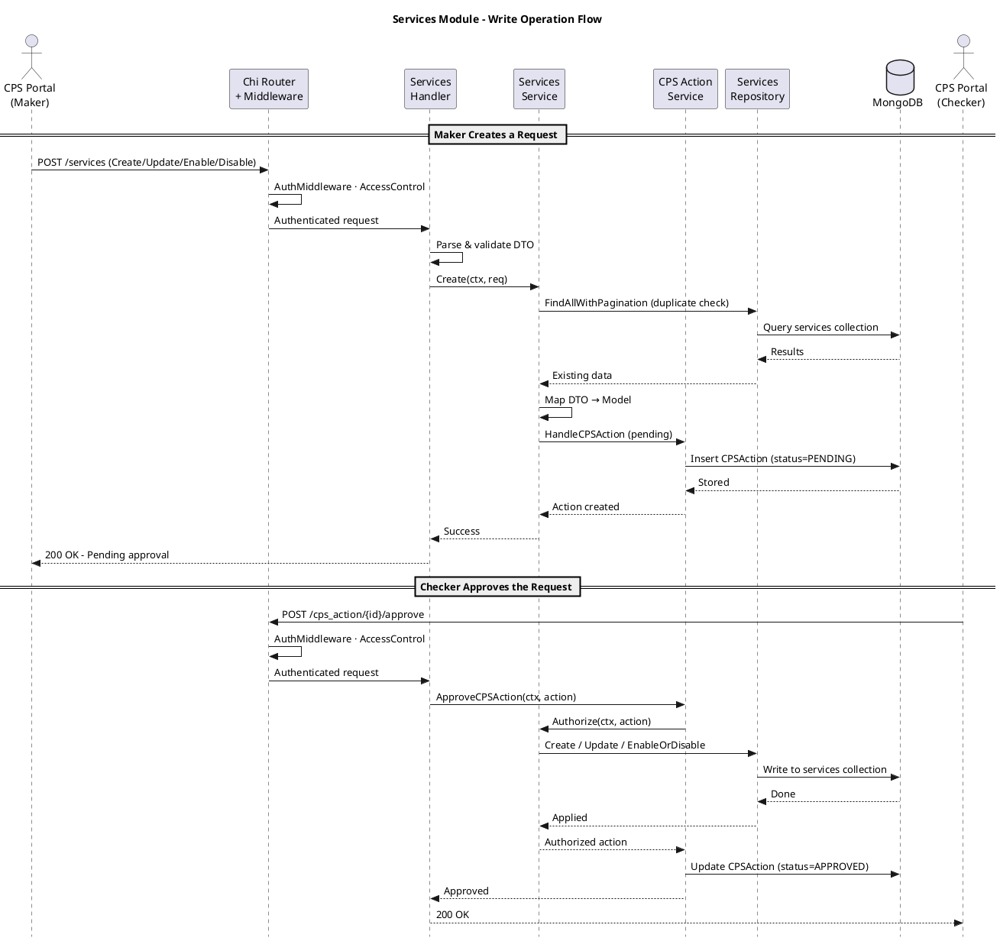
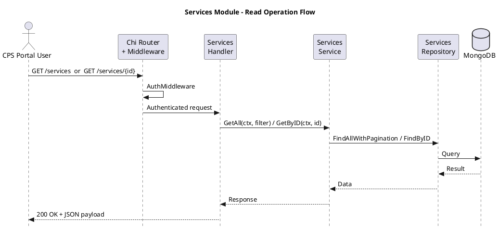
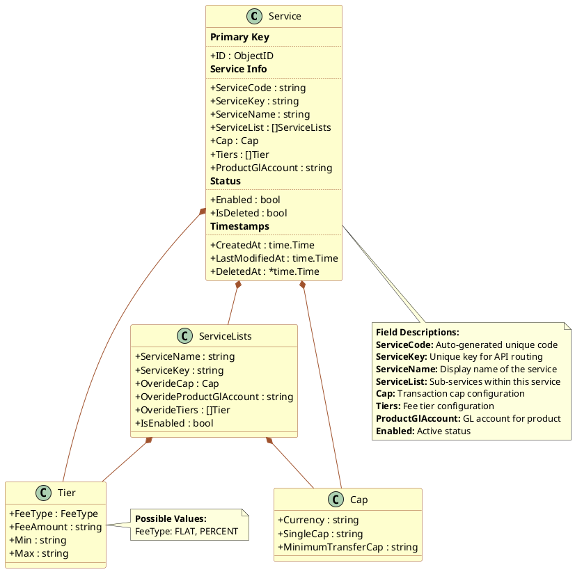

## Module: services

**Description:** This feature defines the different CPS services (for example transfer types or payment services) that can be used in the system. It stores a name, code, and optional limits on how much can be transferred per transaction.

Users will mainly use it when adding a new type of service, adjusting limits, or temporarily disabling a service.

---

### Screen / Form: Create Service

**Purpose:**  
To register a new service that can be used within the CPS platform.

**Input Fields**

**Service name**

- **Type:** Text  
- **Required:** Yes  
- **Description:** A clear and readable name of the service as it should appear to internal users (for example “Wallet to Wallet Transfer”).
- **Rules:**  
  - Use letters, numbers, and spaces.  
  - Avoid unnecessary symbols.

**Service key**

- **Type:** Text  
- **Required:** Yes  
- **Description:** A short internal key used by the system to refer to this service.
- **Rules:**  
  - Should be unique.  
  - Typically uses uppercase letters and underscores (for example `WALLET_TO_WALLET`).

**Service code**

- **Type:** Text  
- **Required:** Yes  
- **Description:** A code used for integration, configuration, or reporting.
- **Rules:**  
  - Should follow your internal coding standards.  
  - Must be unique among services.

**CBE GL product account**

- **Type:** Text  
- **Required:** No  
- **Description:** The internal general ledger (GL) product account used for accounting entries related to this service.

**Cap (optional section – transaction limits)**

This section may be collapsed or optional. If used, all fields inside should be completed:

**Single transaction limit**

- **Type:** Number / Decimal  
- **Required:** Yes (if the cap section is used)  
- **Description:** The maximum amount allowed for a single transaction using this service.
- **Rules:**  
  - Must be zero or higher.  
  - Should reflect real business rules for this service.

**Minimum transfer amount**

- **Type:** Number / Decimal  
- **Required:** Yes (if the cap section is used)  
- **Description:** The smallest allowed transaction amount for this service.
- **Rules:**  
  - Must be zero or higher.  
  - Must not be greater than the **Single transaction limit**.

**Enabled**

- **Type:** Checkbox / Toggle  
- **Required:** No  
- **Description:** If turned on, the service is active and can be used.

**Marked as deleted**

- **Type:** Checkbox / Toggle  
- **Required:** No  
- **Description:** For internal use when the service should be treated as removed but still kept for history.

**Example (Correctly Filled Form)**

Service name: `Wallet to Wallet Transfer`  
Service key: `WALLET_TO_WALLET_TRANSFER`  
Service code: `W2W_TRF`  
CBE GL product account: `GL-TRF-001`  
Single transaction limit: `50,000.00`  
Minimum transfer amount: `10.00`  
Enabled: `On`  
Marked as deleted: `Off`

**Common Mistakes**

- Setting the **Minimum transfer amount** higher than the **Single transaction limit**.  
- Reusing an existing **Service key** or **Service code**.  
- Leaving limits blank when the business requires them to be enforced.

---

### Screen / Form: Edit Service

**Purpose:**  
To update the details or limits of an existing service.

**Input Fields**

The same as **Create Service**, but all fields are optional to change:

- Service name (optional)  
- Service key (optional)  
- Service code (optional)  
- CBE GL product account (optional)  
- Single transaction limit (optional, if caps are used)  
- Minimum transfer amount (optional, if caps are used)  
- Enabled (optional)  
- Marked as deleted (optional)

**Example (Correctly Filled Form)**

Service name: `Wallet to Wallet Transfer`  
Single transaction limit: `100,000.00`  
Minimum transfer amount: `10.00`

**Common Mistakes**

- Increasing limits without confirming with risk or compliance teams.  
- Changing the **Service key** or **Service code** without checking other systems that depend on them.

---

### Screen / Form: Search and List Services

**Purpose:**  
To view all services, filter them, and open them for configuration or review.

**Input Fields**

**Page**

- **Type:** Number  
- **Required:** No

**Items per page**

- **Type:** Number  
- **Required:** No

**Service name**

- **Type:** Text  
- **Required:** No  
- **Description:** Filter by service name.

**Service code**

- **Type:** Text  
- **Required:** No  
- **Description:** Filter by service code.

**Service type**

- **Type:** Text  
- **Required:** No  
- **Description:** Filter by service type label (if used in your setup).

**Enabled**

- **Type:** Checkbox / Toggle  
- **Required:** No  
- **Description:** Show only active/inactive services.

**Search**

- **Type:** Text  
- **Required:** No  
- **Description:** Simple search across name, code, and type.

**Filter (advanced)**

- **Type:** Text (advanced)  
- **Required:** No  
- **Description:** Additional structured filters used by advanced users.

**Example (Correctly Filled Form)**

Page: `1`  
Items per page: `20`  
Service name: `Wallet`  
Enabled: `On`  
Search: *(left empty)*

**Common Mistakes**

- Forgetting that a filter is still active and assuming a service has been deleted.  
- Using very generic search terms like `Transfer`, which may return too many results.

---

### Screen / Form: Enable / Disable Service

**Purpose:**  
To quickly activate or deactivate a service.

**Input Fields**

**Enabled**

- **Type:** Checkbox / Toggle  
- **Required:** Yes  
- **Description:** When turned off, the service should no longer be usable for new operations.

**Example (Correctly Filled Form)**

Enabled: `Off` for a legacy service that should not be used anymore  
Enabled: `On` for new services being rolled out

**Common Mistakes**

- Disabling a widely used production service without planning communication and monitoring.  
- Assuming that disabling fully removes the service – it usually stays in lists and history.

---

### Screen / Form: Get Service by ID

**Purpose:**  
To retrieve full details of a single service by its unique identifier.

**Input Fields**

**Service ID**

- **Type:** Text (URL path parameter)  
- **Required:** Yes  
- **Description:** The unique identifier of the service to retrieve.
- **Rules:**  
  - Must be a valid MongoDB ObjectID.

**Example (Correctly Filled Form)**

Service ID: `674003000000000000000001`

**Common Mistakes**

- Providing an invalid or non-existent service ID.  
- Confusing the service ID with the service code or service key.

---

### Screen / Form: Get All Service List

**Purpose:**  
To retrieve all service list entries with pagination. Service lists group related services together for configuration or display.

**Input Fields**

**Page**

- **Type:** Number  
- **Required:** No

**Items per page**

- **Type:** Number  
- **Required:** No

**Example (Correctly Filled Form)**

Page: `1`  
Items per page: `20`

**Common Mistakes**

- Confusing the service list with the main services list.  
- Not using pagination for large datasets.

---

### Screen / Form: Create Service List

**Purpose:**  
To create a new service list entry that groups or categorizes services.

**Input Fields**

**Service list name**

- **Type:** Text  
- **Required:** Yes  
- **Description:** A human-readable name for the service list.
- **Rules:**  
  - Must be unique.  
  - Use letters, numbers, and spaces.

**Service list key**

- **Type:** Text  
- **Required:** Yes  
- **Description:** A short internal key for the service list.
- **Rules:**  
  - Should be unique.  
  - Typically uppercase with underscores.

**Example (Correctly Filled Form)**

Service list name: `Payment Services`  
Service list key: `PAYMENT_SERVICES`

**Common Mistakes**

- Reusing an existing service list key.  
- Creating duplicate service lists with slightly different names.

---

### Screen / Form: Update Service List

**Purpose:**  
To modify an existing service list entry.

**Input Fields**

**Service list ID**

- **Type:** Text (URL path parameter)  
- **Required:** Yes  
- **Description:** The unique identifier of the service list to update.

**Service list name**

- **Type:** Text  
- **Required:** No (optional to change)

**Service list key**

- **Type:** Text  
- **Required:** No (optional to change)

**Example (Correctly Filled Form)**

Service list ID: `674003000000000000000001`  
Service list name: `Updated Payment Services`

**Common Mistakes**

- Changing the service list key without verifying dependencies in other modules.  
- Updating a service list that is currently in active use without coordination.

---

## Component Interaction Flow

### Write Operation (Create / Update / Enable / Disable Service)

### Read Operation (Get All Services / Get Service by ID)

---

## Data Models

### Core Entity: Service

*Figure 1: Service Entity Model*

| Field | Type | Description |
|-------|------|-------------|
| ID | ObjectID | Unique identifier |
| ServiceCode | string | Auto-generated unique service code |
| ServiceKey | string | Unique key identifier for API routing |
| ServiceName | string | Display name of the service |
| ServiceList | []ServiceLists | Sub-services within this service |
| Cap | Cap | Transaction cap configuration (currency, single cap, minimum) |
| Tiers | []Tier | Fee tier configuration (flat/percent, amount, min/max) |
| ProductGlAccount | string | GL account for the product |
| Enabled | bool | Active status of the service |
| IsDeleted | bool | Soft delete flag |
| CreatedAt | time.Time | Timestamp of creation |
| LastModifiedAt | time.Time | Timestamp of last modification |
| DeletedAt | *time.Time | Timestamp of deletion (nullable) |
